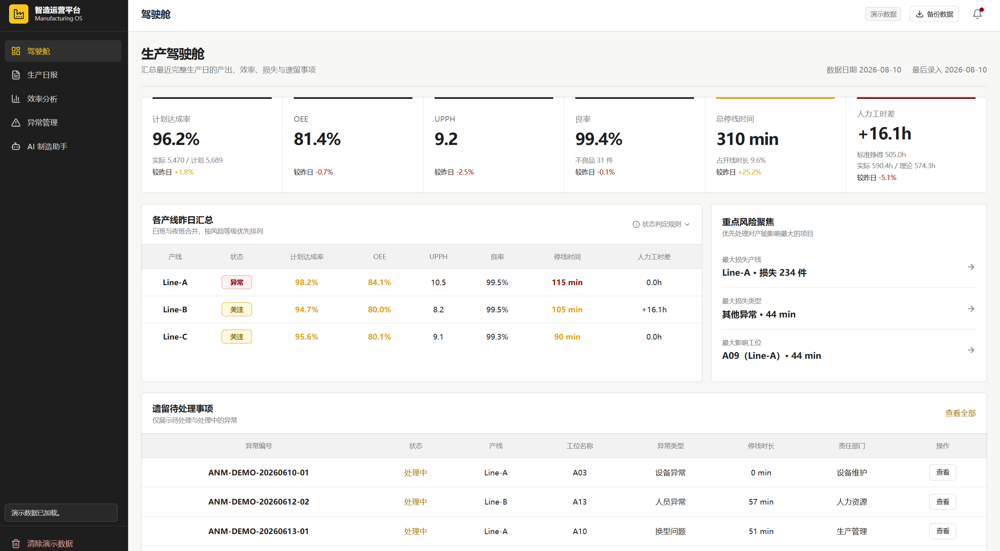
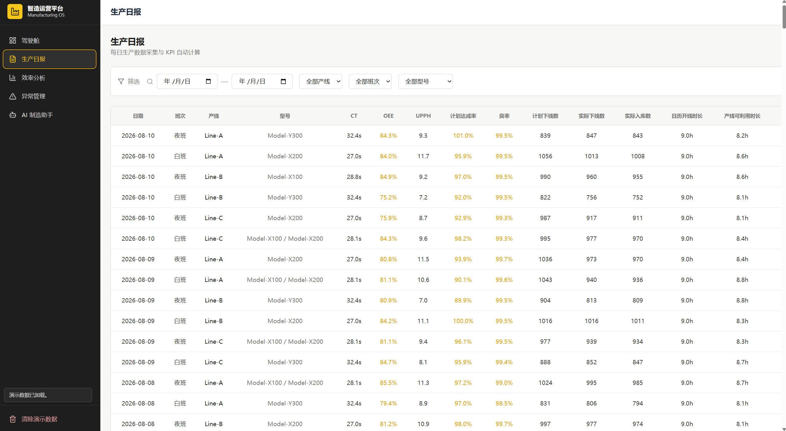
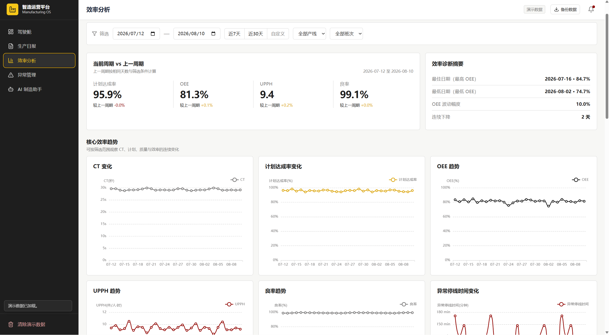
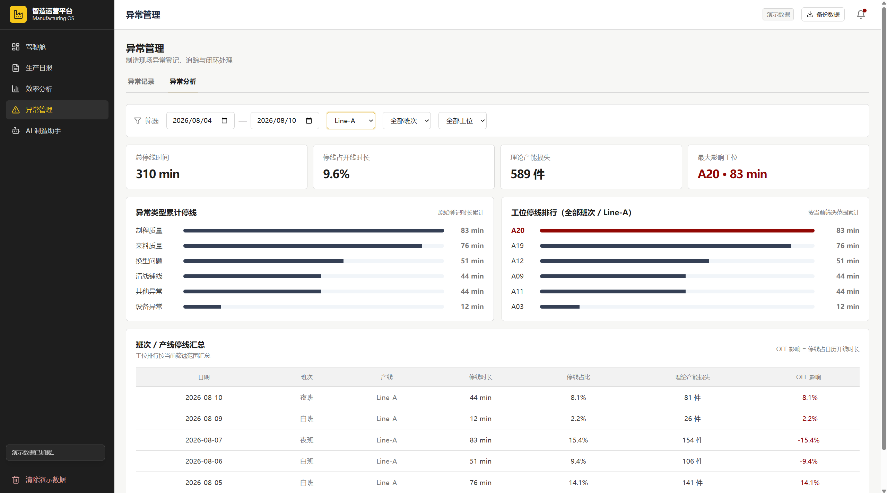

# Production Line Signal / 产线信号

Manufacturing Operations Dashboard for Lean Improvement

[English](./README.en.md) ｜ 中文

面向精益改善工程师和生产运营人员的轻量级生产数据管理与改善分析平台。适用于暂时无法实时接入 MES、设备或 IoT 数据，主要依靠人工登记与浏览器本地数据运行，并支持记录导出与本地备份的制造现场。

## 页面预览

> 以下为加载演示数据后的本地界面示例；点击图片可查看大图。

| 驾驶舱 | 生产日报 |
| --- | --- |
| [](docs/images/dashboard.png) | [](docs/images/daily-report.png) |

| 效率分析 | 异常分析 |
| --- | --- |
| [](docs/images/efficiency-analysis.png) | [](docs/images/anomaly-analysis.png) |

## 1. 项目简介

平台将分散在纸质日报、Excel 和口头沟通中的"班次生产数据—产品产出—人力投入—停线异常—改善优先级"流程，整合为可录入、可计算、可下钻、可导出的数字化闭环：驾驶舱汇总最近完整生产日并识别风险，效率分析负责趋势与人力投入产出，异常管理负责停线损失定位，生产日报保留原始数据并承接跨页面下钻。

平台不是实时 MES，也不是 ERP；它是在无系统支撑条件下先统一口径、再支撑改善决策的运营工作台。

## 2. 项目背景

本项目来源于暂未接入 MES 的制造现场生产管理与精益改善需求。原始流程依赖纸质生产日报、Excel 手工统计和班组口头沟通，核心问题不是"没有数据"，而是数据之间没有稳定关系：同一班次的产量、人力和时间容易被重复统计，白班与夜班的指标被简单平均，计划停机与异常停线混在一起，多个异常重叠时停线时间被重复累计。

作者先梳理业务对象、指标口径和页面信息架构（从现场工作提炼为思维导图与数据模型），再逐步实现为本平台。项目未在任何企业正式部署，界面中的数据为演示数据。

## 3. 适用场景

- 尚未部署 MES，或 MES 覆盖不到车间末端数据采集的制造现场；
- 依赖人工日报、Excel 汇总口径的生产运营与精益改善岗位；
- 需要统一 OEE、UPPH、良率等指标口径并快速定位停线损失的改善工程师。

## 4. 核心功能

- **最近完整生产日驾驶舱**：汇总最近完整生产日（正常情况为昨日；昨日尚未录入时自动回退到最近有数据的完整生产日）的核心指标、各产线风险分级（正常／关注／异常）与重点风险聚焦（最大损失产线、最大损失类型、最大影响工位）；
- **生产日报**：按"日期 × 产线 × 班次"录入原始数据，支持编辑与删除（删除需二次确认），自动计算派生指标；
- **多型号产品明细**：同一班次生产多个型号时作为同一张日报的产品明细维护，不拆分日报；
- **效率分析**：CT、计划达成率、OEE、UPPH、良率趋势，周期对比，下钻至具体日报；
- **人力投入分析**：实际出勤总工时、理论出勤工时、标准挣得工时与人力效率对比；
- **异常登记与异常分析**：异常类型、工位、责任部门、停线时长登记，支持删除（二次确认），异常类型排行与工位排行；
- **异常复发提醒**：识别同工位、同类型反复发生的异常；
- **页面下钻与 URL 上下文**：驾驶舱、效率分析、异常分析与生产日报之间的条件穿透，日期／产线／班次／指标上下文在 URL 中保留；
- **基础资料管理**：产线、产品型号（可设默认 CT）、工位、责任部门与异常类型的就地新增和编辑，内置于生产日报与异常登记页；
- **数据导出**：生产日报和异常记录导出为 UTF-8 BOM CSV（Excel 可直接打开），可选择导出当前筛选结果或全部数据；
- **规则型 AI 制造助手**：基于统一数据中心回答常见分析问题，每个结论附带可点击的数据依据（生产日报、异常记录和指标引用），数据不足时明确提示；被引用的源记录删除后，引用会标注"来源记录已删除"，不编造结论；
- **AI 对话管理**："清除演示数据"时仅删除基于演示数据的对话轮次，手工数据上下文的对话保留；"清空对话记录"为独立操作，二次确认后清空全部本地对话，不删除任何日报、异常或基础资料。

## 5. 核心业务规则

1. 同一日期、同一产线、同一班次只能存在一张日报（Repository 层强制约束）；
2. 多型号生产作为同一张日报的产品明细维护，避免时间、人力按型号重复计算；
3. CT 按合格产量加权，不对比率或 CT 值做简单平均；
4. 日级 OEE、UPPH、计划达成率、良率一律从基础数量与工时重新聚合，不做班次指标平均；
5. 计划停机（点检、5S、计划维护）与异常停线分开统计；
6. 总异常停线时间、工位停线排行与 OEE 影响使用区间合并后的去重停线时间；异常类型累计停线使用原始登记时长累计以保留类型归因，该口径不等于去重后的产线总停线时间；跨班次异常按班次边界拆分并归属正确工作日；
7. 产线可利用时长仅扣除吃饭时长，不扣除计划停机或异常停线；两类停线作为独立损失统计。

## 6. 主要指标口径

| 指标 | 口径 |
| --- | --- |
| 实际入库数 | 实际下线数 − 不良品数 |
| 加权 CT | Σ(各型号合格入库数 × CT) ÷ Σ合格入库数 |
| 计划达成率 | Σ实际下线数 ÷ Σ计划下线数 |
| 良率 | Σ实际入库数 ÷ Σ实际下线数 |
| OEE | Σ(合格入库数 × CT) ÷ Σ日历开线时长（简化口径，非三要素完整 OEE） |
| UPPH | Σ实际入库数 ÷ Σ实际出勤总工时 |
| 日历开线时长 | 班次时长 |
| 产线可利用时长 | 日历开线时长 − 吃饭时长 |
| 实际出勤总工时 | 实际出勤人数 × 产线可利用时长 |
| 理论出勤工时 | 定编人数 × 产线可利用时长 |
| 标准挣得工时 | Σ(各型号合格入库数 × CT × 线体定编人数)，CT 以小时计 |
| 总停线时间 | 计划停机时长 + 去重后的异常停线时长 |

## 7. 数据架构

- React 全局 Store：页面共享同一数据来源；
- Repository 数据访问层：隔离持久化细节，并强制日报唯一性约束；
- IndexedDB 持久化：数据保存在访问者浏览器本地；
- 统一 KPI Service：驾驶舱、效率分析、日报、导出和 AI 助手引用共用同一套计算逻辑；
- 模拟数据作为可选 seed，由用户在侧栏中主动加载或清除；首次打开不写入业务演示数据，也不预置产线、型号、工位、部门或异常类型。基础资料可直接在日报和异常登记表单的对应字段旁新增、编辑。

## 8. 技术栈

React、TypeScript、Vite、Tailwind CSS、ECharts、React Router、IndexedDB。无后端服务。

## 9. 开发方式

业务场景梳理、制造指标口径、产品逻辑、页面结构和验收标准由作者负责；代码实现过程使用 AI 编程工具辅助完成实现、排查、原型迭代和文档整理。关键业务规则、数据口径和最终验收由作者判断，AI 生成结果中的口径错误（如对比率做简单平均、停线重复统计）均在验收中被发现并纠正。本项目是"业务建模由人负责、实现由 AI 加速"的一次完整实践，不是 AI 全自动生成的产品。

## 10. 本地运行

运行环境：

- Node.js 22.13+
- pnpm 11.17.0
- 本版本已在 Node.js v24.18.0、pnpm 11.17.0 下验证

```bash
pnpm install --frozen-lockfile
pnpm run dev
```

启动后访问 http://localhost:5173 。首次打开没有业务记录和业务基础资料；可直接在日报、异常登记表单中建立自己的产线、型号、工位、部门和异常类型。也可在左下角点击“加载演示数据”体验完整业务闭环；再次点击可清除演示数据，手工录入数据不会被删除。

## 11. 验证命令

```bash
pnpm run verify:data
pnpm run verify:demo
pnpm run verify:ai-context
pnpm run build
```

## 12. 在线演示

待部署。部署完成后将在此更新链接。

部署说明：本仓库已提供 Vercel 的 SPA 路由回退配置（vercel.json），直接访问和刷新子路由不会 404；使用其他静态托管平台时，需要配置等效的 index.html 回退规则。

## 13. 演示数据说明

平台内置可选演示数据（产线、型号、工位和异常记录均为虚构），仅用于演示业务闭环与指标口径，不代表任何真实工厂的生产表现。演示数据不会在首次打开时自动写入，可通过左下角按钮随时加载或清除。清除时仅删除 `dataSource=seed` 的业务数据与未被手工记录引用的演示基础资料。

## 14. 数据持久化与备份

所有数据保存在访问者自己浏览器的 IndexedDB 中，不上传任何服务器。清理浏览器数据、更换浏览器或更换设备都会导致数据丢失。重要数据应先使用"备份数据"功能导出保存。

## 15. 当前限制

- 暂不支持真正的多人协作；
- 暂无后端数据库，数据仅存于浏览器本地；
- 暂未连接 MES、ERP、IoT 或设备实时数据；
- AI 助手为规则型分析，未接入大语言模型接口；
- 当前界面以中文为主，提供中英文 README，尚未实现界面语言切换。

## 16. 后续规划

- 后端服务与数据库，登录、权限与审计；
- 多人协作与角色控制；
- MES、ERP、IoT 数据接入；
- 更完整的数据备份与恢复；
- 界面国际化；
- 本公开仓库将作为后续主开发仓库持续增量提交。

## 17. 许可证

本项目以 PolyForm Noncommercial License 1.0.0 提供，属于公开源码（source-available），不是 OSI 意义上的开源许可证项目。

- 允许个人学习、研究、测试及其他符合许可证定义的非商业用途；
- 企业或个人不得将本项目直接用于商业经营、付费服务、商业交付或其他商业用途；
- 商业使用需获得版权所有者书面授权，可通过 GitHub 仓库 Issues 联系；
- 具体权利义务以 [LICENSE](./LICENSE) 为准，本节说明不构成法律意见。

## 18. 免责声明

本项目按"现状"提供，用于技术交流与学习。作者不对使用本项目产生的任何直接或间接后果承担责任。演示数据均为虚构，不代表任何真实工厂的表现。
